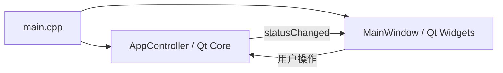

# Zoey 架构与开发约定

## 目标与当前范围

Zoey 是运行在 ROCK 5 ITX 上的 Qt/C++ 本地 AI 与 IoT 应用。本次整理统一构建入口、源码布局和模块边界，保持基础窗口及状态按钮行为，并修复窗口析构时使用未初始化指针的问题。

当前实现只有应用入口、基础窗口与状态协调。AI、设备管理和 MQTT 目录提供开发约定；其服务客户端、设备协议、工具调用均尚未实现。状态 `Listening...` 仍是演示状态，不表示已经启动麦克风或模型推理。

## 目录职责

| 路径 | 职责 |
| --- | --- |
| `CMakeLists.txt` | 项目名称、依赖、构建选项、安装和测试入口 |
| `CMakePresets.json` | 可共享的 Debug/Release 构建与测试配置 |
| `src/main.cpp` | 创建应用与模块，连接生命周期，显示主窗口 |
| `src/ui/` | 窗口、布局与用户交互；当前采用手写 Widgets |
| `src/core/` | 应用状态和业务协调；不依赖 Qt Widgets |
| `src/ai/` | 后续实现推理服务客户端、对话请求与响应 |
| `src/devices/` | 后续实现设备信息、状态、能力与操作 |
| `src/mqtt/` | 后续实现 MQTT 连接、订阅、发布与消息转换 |
| `config/` | 可提交的配置示例；本机配置不提交 |
| `tests/` | 核心行为与界面集成测试 |
| `docs/` | 架构、开发方式与实施记录 |
| `build/` | 构建生成文件，不提交 |

不创建没有调用者的 Manager 类或空 CMake 库。新增功能时，在对应模块中实现最小可运行流程，再添加构建目标。

## 当前依赖与生命周期



`AppController` 持有当前状态，通过 `startListening()` 进入演示状态，并在状态实际变化时发出 `statusChanged`。`MainWindow` 通过构造参数获得控制器引用，显示初始状态、转发按钮操作并订阅状态通知。控制器先创建、后销毁，寿命覆盖窗口；窗口不拥有控制器。

控件通过 Qt 父子关系销毁。当前不使用 Designer，因此没有 `Ui::MainWindow` 指针、生成的 `ui_mainwindow.h` 或闲置 `.ui` 文件。未来单个窗口可以改用 Designer，但应同时更新其初始化、资源和构建定义。

## 后续业务依赖

建议的数据流：

```text
用户操作 → UI → Core → AI 客户端 → llama-server
                    ↓
                 设备管理 → MQTT 客户端 → Mosquitto → 设备

设备消息 → MQTT 客户端 → 设备状态 → Core → UI
AI 工具请求 → Core 校验与分派 → 设备操作 → 执行结果 → AI/UI
```

- UI 不直接调用 HTTP、MQTT 或解析设备协议。
- Core 协调模块；AI 不直接依赖 MQTT，MQTT 不依赖 UI。
- 设备模块定义状态和操作含义，MQTT 模块负责传输与消息转换。
- 接入真实设备控制时，Core 负责工具白名单、参数与设备能力校验；将设备确认与命令已发送区分开。
- AI 和 MQTT 模块依赖 Qt Core/Network 或相应协议库；只在接入时添加所需依赖。
- `llama-server` 与 Mosquitto 作为独立进程运行，地址通过配置指定。以后若需进程管理，将其与请求客户端分开。

## 异步、错误与线程

网络请求使用异步 API，UI 线程不等待推理、网络或进程结束。异步结果通过信号返回 Core，再更新 UI。仅在确有阻塞工作时增加工作线程，并明确对象所属线程及退出清理方式。

新增客户端应提供成功、失败、取消和超时路径；服务不可用时保留可操作界面并显示错误。MQTT 重连、请求取消和设备离线策略在接入对应功能时实现，不在基础架构中假装已支持。

## 构建与扩展

基础依赖为 CMake 3.21+、C++17、Qt 5 或 Qt 6 的 Core/Widgets。测试额外依赖同一 Qt 版本的 Test 组件；可用 `BUILD_TESTING=OFF` 禁用。统一使用根目录构建，`zoey_core` 为核心库，`Zoey` 为应用。

实现第一个 AI 流程时：先完成异步请求、响应与错误处理，再由 Core 暴露业务操作给窗口。实现设备流程时：先明确设备模型和消息格式，再连接 MQTT。新增 `.cpp/.h` 文件需在所属目标的 `CMakeLists.txt` 中显式列出。

应用外部依赖、模型权重、旧构建缓存、本机绝对路径和个人 IDE 配置不属于源码。配置示例当前仅描述约定，程序尚不读取它。
