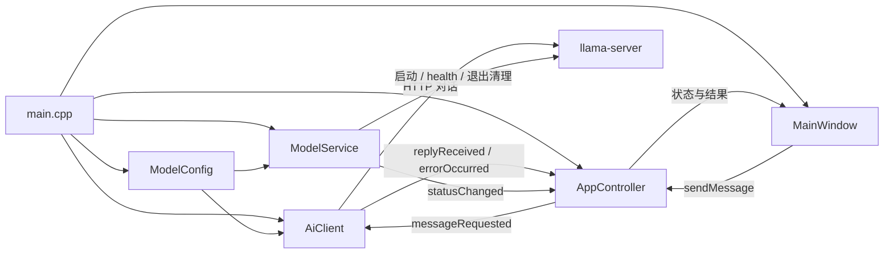

# Zoey 架构与开发约定

## 当前范围

Zoey 是运行在 ROCK 5 ITX 上的 Qt/C++ 本地 AI 与 IoT 应用。目前已实现 Qt 对话界面、应用状态协调、llama-server 自动启动与健康检查，以及单次非流式 HTTP 对话。设备管理、MQTT、工具调用和录音仍属于后续规划。

应用采用 UI、Core、AI 分层，共享模型参数；进程退出状态和窗口初始状态通过控制器同步。

## 目录职责

| 路径 | 职责 |
| --- | --- |
| `CMakeLists.txt` / `CMakePresets.json` | 统一构建入口、依赖、Debug/Release 配置与测试入口 |
| `src/main.cpp` | 创建配置和模块、连接信号、显示窗口并安排服务启动 |
| `src/ui/` | 手写 Widgets 窗口、用户输入、状态与对话记录展示 |
| `src/core/` | 服务状态与对话忙碌状态、请求校验和结果转发；不依赖 Widgets |
| `src/ai/modelconfig.h` | 共享模型标识、地址、路径及超时参数 |
| `src/ai/modelservice.h/.cpp` | 本应用创建的 llama-server 进程及加载健康检查 |
| `src/ai/aiclient.h/.cpp` | HTTP 对话请求、JSON 响应解析与错误返回 |
| `src/devices/` / `src/mqtt/` | 后续模块的开发约定，目前没有业务实现 |
| `config/` | 配置示例；当前不由应用读取，本机配置不提交 |
| `tests/` | 现有核心与界面测试；旧按钮用例尚未适配对话界面 |
| `docs/` | 架构、开发指南、设计与实施计划 |
| `build/` | 编译产物，不提交 |

不创建没有调用者的 Manager 类、接口层或空 CMake 库。新增功能先实现一个完整流程，再根据实际职责划分模块。

## 当前对象与数据流


```mermaid
flowchart LR
    Entry[main.cpp] --> Config[ModelConfig]
    Entry --> Window[MainWindow]
    Entry --> Core[AppController]
    Entry --> Client[AiClient]
    Entry --> Service[ModelService]
    Config --> Client
    Config --> Service
    Window -->|sendMessage| Core
    Core -->|messageRequested| Client
    Client -->|HTTP 对话| Server[llama-server]
    Client -->|replyReceived / errorOccurred| Core
    Core -->|状态与结果| Window
    Service -->|启动 / health / 退出清理| Server
    Service -->|statusChanged| Core
```

图中的连线表示对象组装和业务消息流。实际编译依赖为 `Zoey → zoey_core / zoey_ai / Qt Widgets`；`zoey_core` 仅依赖 Qt Core，`zoey_ai` 依赖 Qt Core/Network。Core 与 AI 通过入口中的信号连接协作，不直接相互包含头文件。

### 一次对话

1. 窗口整理输入并展示“你：”，随后调用 `AppController::sendMessage()`。
2. Core 忽略空消息和忙碌期间的请求，先发出 `busyChanged(true)`，再发出 `messageRequested`。
3. AiClient 构造单条 user 消息并异步 POST 到 `/v1/chat/completions`。
4. 网络完成后解析 JSON，成功时取第一个 choice 的 `message.content`，失败时发出对应错误。
5. Core 在成功和失败两条路径中都先恢复可发送状态，再转发结果；窗口追加回复或错误文字。

界面的聊天记录只是展示内容，每次请求不携带此前输入和回复。当前不支持流式输出、取消请求、自动重试和多轮上下文。

### 服务生命周期

入口在事件循环开始后调用 `ModelService::start()`。QProcess 的 started 信号只表示进程已启动，此时显示“模型加载中…”并请求 `/health`。请求成功且 HTTP 状态为 200 才显示“模型已就绪”。其余结果在进程仍运行时安排下一次检查，检查间隔默认 1000 ms；成功后不再轮询。

QProcess 的错误与退出信号在整个进程生命周期内有效，因此就绪后退出也会更新状态。崩溃错误保留具体原因，健康检查发现进程已停止时直接结束，避免通用停止提示覆盖错误。

尚未设置模型加载的总等待期限，也没有自动重启或就绪后的持续健康检查。窗口不根据服务状态禁止发送；提前发送由现有 HTTP 错误处理返回结果。

### 两个状态维度

`AppController::status()` 保存服务或演示状态，`isBusy()` 表示当前对话是否等待结果，两者独立。生成期间窗口显示“正在生成...”，并禁用发送按钮；后台服务状态仍会更新。生成结束后窗口显示最新保存的服务状态。窗口构造完成时主动刷新一次，以正确显示控制器已有的忙碌状态。

`startListening()` 只通过统一的 `setStatus()` 设置演示文字 `Listening...`，不表示录音已开始。保留这个入口是为了兼容原型调用。

## 对象所有权与退出

`main.cpp` 按配置、ModelService、AiClient、AppController、MainWindow 的顺序创建对象，退出时按逆序销毁；所有模块都先于 QApplication 销毁。窗口对控制器持有非拥有引用，控制器的生命期覆盖窗口。

控件和布局由 Qt 父子关系管理。两个 AI 对象分别拥有自己的 QNetworkAccessManager；ModelService 还拥有 QProcess。QProcess 对象的析构不应代替服务退出策略，因此 ModelService 先 terminate，最多等待 3000 ms，再在必要时 kill 并等待最多 1000 ms。

对进程结束的等待仅用于退出清理。运行期间的网络请求、健康检查和进程启动使用异步信号，不为推理新建线程，也不在窗口回调中等待。

网络 reply 在完成回调中调用 `deleteLater()`，每个结果分支都安排释放。所有捕获窗口控件或服务对象的连接与定时回调都有 QObject context，对象销毁时 Qt 自动断开关联。ModelService 退出清理前还断开进程到自身的状态回调，避免析构时继续发布进程状态。

## 共享参数

ModelConfig 的默认值集中定义在 [modelconfig.h](../src/ai/modelconfig.h)，由入口创建并传给两个 AI 对象；对象保存配置值。进程的模型、主机、端口与 HTTP 请求使用同一个来源，`endpoint()` 用 QUrl 生成各协议路径。

默认目录为用户主目录下的 `llama.cpp`，程序相对路径为 `build/bin/llama-server`。模型标识为 `Qwen/Qwen3-4B-GGUF:Q4_K_M`，地址为 `127.0.0.1:8080`，上下文容量 8192 token，回复上限 128 token。请求传输超时为 180000 ms，健康检查传输超时为 2000 ms；这是传输无数据活动的超时，不是推理或加载流程的总时限。

请求保留 `stream=false` 和 `chat_template_kwargs.enable_thinking=false`。JSON 配置示例尚未接入程序，详细约定见 [配置说明](../config/README.md)。

## 后续扩展边界

```text
用户操作 → UI → Core → AI 客户端 → llama-server
                    ↓
                 设备管理 → MQTT 客户端 → Mosquitto → 设备

设备消息 → MQTT 客户端 → 设备状态 → Core → UI
AI 工具请求 → Core 校验与分派 → 设备操作 → 执行结果 → AI/UI
```

- UI 不直接拼装 HTTP 请求、MQTT 消息或设备协议。
- AI 不直接依赖 MQTT，MQTT 不依赖 UI；设备模块负责状态和操作含义。
- 真实工具控制接入时，Core 校验工具白名单、参数和设备能力，区分命令发送、设备确认与实际执行成功。
- 只有存在实际替换或测试需要时才增加接口层；阻塞工作确有需要时才增加工作线程。
- 模型权重、外部 llama.cpp 源码、本机绝对路径和个人 IDE 配置不属于本仓库源码。

## 阅读路线

推荐从 [main.cpp](../src/main.cpp) 看对象组装，再依次阅读 Core、UI、AiClient 和 ModelService；具体阅读路线见 [开发指南](development.md)。
